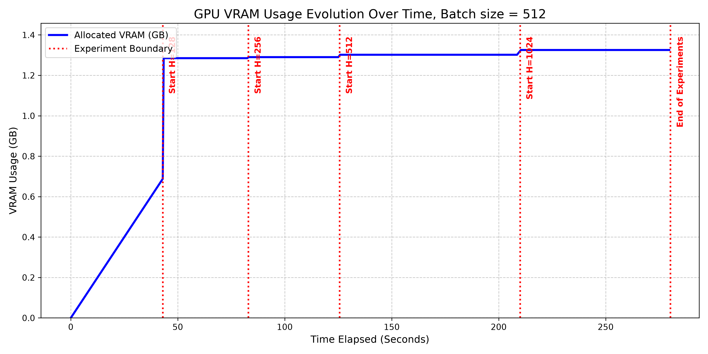
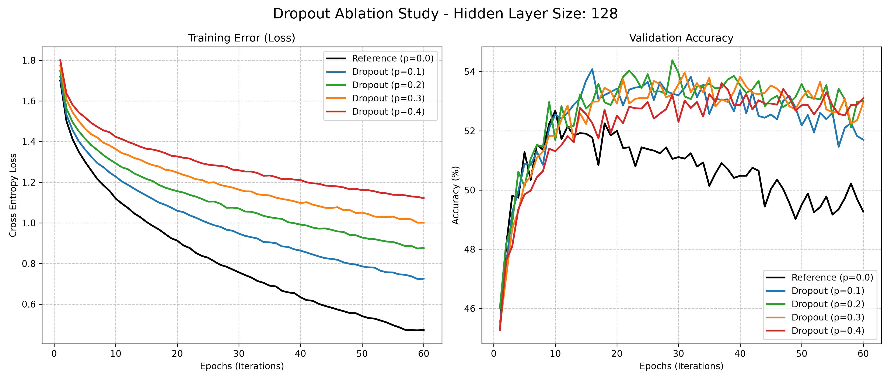
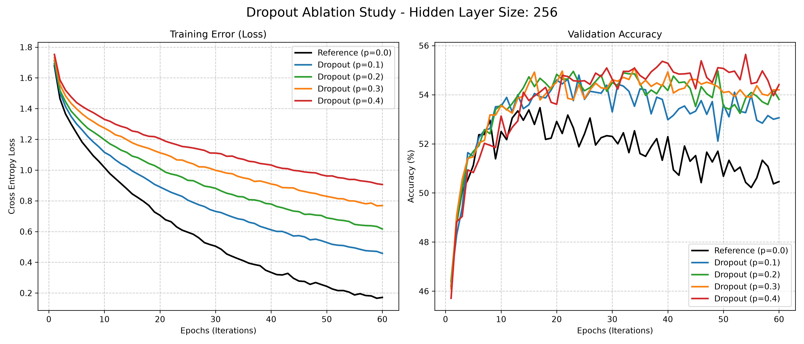
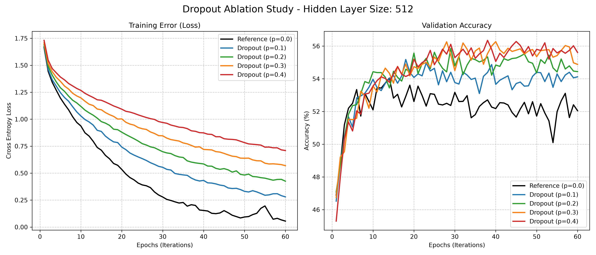
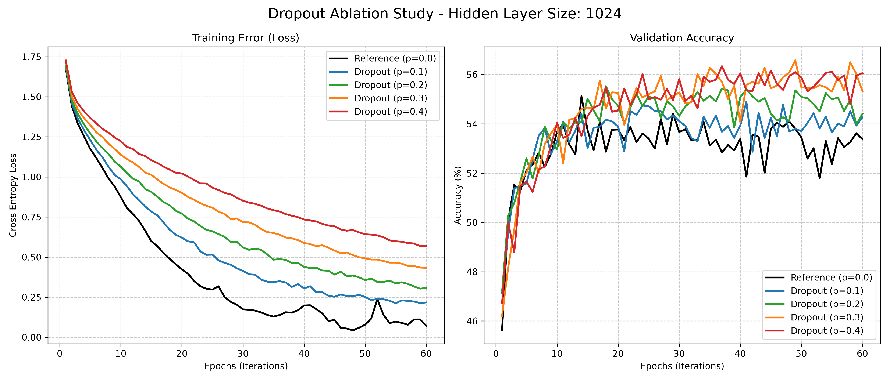

# GPU-Accelerated Dropout Ablation Study on CIFAR10
[](https://creativecommons.org/licenses/by-nc/4.0/)

This repository serves as practice to utilize GPU optimization on ML projects. This study features an ablation study of 4 different Multi-Layer Perceptron (MLP) trained on the CIFAR-10 image dataset. The goal is to observe the phenomenon of Dropout to refresh first principles, but also witness the efficiency of loading the entire dataset directly into VRAM emphasizing PyTorch CUDA optimization.

## GPU Hardware

All experiments conducted on local Nvidia RTX 5070 8GB VRAM laptop.

## Dataset Overview

The project uses the standard CIFAR-10 dataset, which consists of 60,000 color images distributed equally across 10 classes (Airplane, Automobile, Bird, Cat, Deer, Dog, Frog, Horse, Ship, Truck). 

**Dataset Splits & Sizes:**
*   Training Images: 50,000 (5,000 per class)
*   Validation Images: 10,000
*   Train/Val Split: 83% / 17%

**Structural Dimensions:**
*   Original Image Shape: 32 x 32 pixels
*   Color Channels: 3 (RGB)
*   Flattened Tensor Shape: [3, 32, 32] -> 3072 Input Neurons

**Memory Footprint (Float32 for GPU):**
*   Size per Image: 12.00 KB
*   Training Dataset VRAM: ~585.94 MB
*   Validation Dataset VRAM: ~117.19 MB
*   Total VRAM Required: ~703.12 MB

## Model Architecture

The model is a standard Single Hidden Layer Multi-Layer Perceptron (MLP). The network maps the 3072 input pixels to a specified hidden dimension, applies non-linearity, and outputs the 10 class logits.

**Without Dropout (Reference Base):**
The forward pass is:
`Output = W_2 * (ReLU(W_1 * X + b_1)) + b_2`

**With Dropout:**
The forward pass becomes:
`Output = W_2 * (Dropout(ReLU(W_1 * X + b_1), p)) + b_2`

Where `p` is the probability of an element to be zeroed. More details at:

[Dropout: A Simple Way to Prevent Neural Networks from
Overfitting](https://jmlr.org/papers/volume15/srivastava14a/srivastava14a.pdf)

## Experimental Methodology

The experiment analyzes the relationship between hidden layer size and dropout probability `p`. 

*   **Network Capacities Tested:** Hidden sizes of 128, 256, 512, and 1024 neurons.
*   **Dropout Rates Tested:** 0.0 (Reference), 0.1, 0.2, 0.3, and 0.4.
*   **Hyperparameters:** 60 epochs per configuration, Adam optimizer, learning rate of 1e-3, and a batch size of 512.

To maximize throughput, the dataset is loaded into GPU VRAM prior to the training loops. 

### Global VRAM Usage Over Time
Global VRAM allocation tracked throughout the execution of the entire experiment.



The linear function is when the entire dataset is being loaded in the GPU. Additional 600MB added for CUDA Overhead and small additional memory due to different size models previously computed.

## Results & Visualizations

The following plots detail the Training Cross-Entropy Loss and Validation Accuracy across all configurations. All experiments performed with `torch.manual_seed(42)` for reproducibility.









## Implementation Methodology and AI Assistance

All scripts generated with Gemini-pro 3.1. All code manually checked, data analysis and experiments designed by me. 

## Running the Code

The complete study is in `Pytorch-CIFAR10-experiments.py` script. Requires Nvidia GPU, 2GB of VRAM are enough.

```bash
python Pytorch-CIFAR10-experiments.py
```
